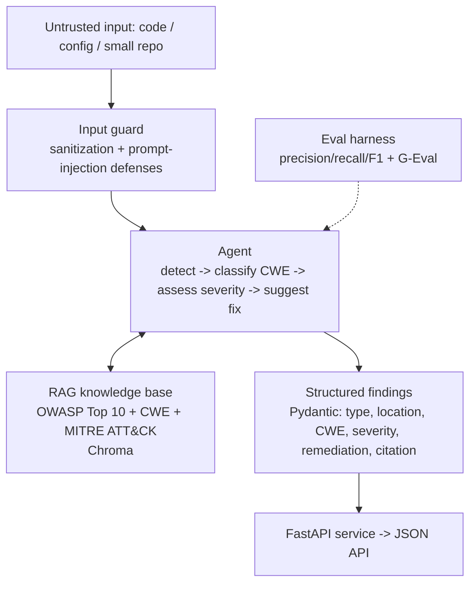

# Architecture

Replace this Mermaid diagram with `architecture.png` once the design is
stable (Week 10 polish), or keep the Mermaid source — GitHub renders it
natively.

See [flagship-project-plan.md](../flagship-project-plan.md) for the full
phased build plan and scope-discipline rules.
